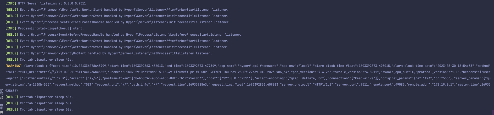
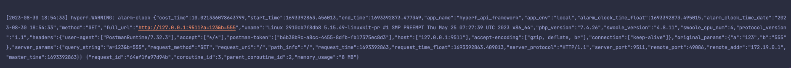
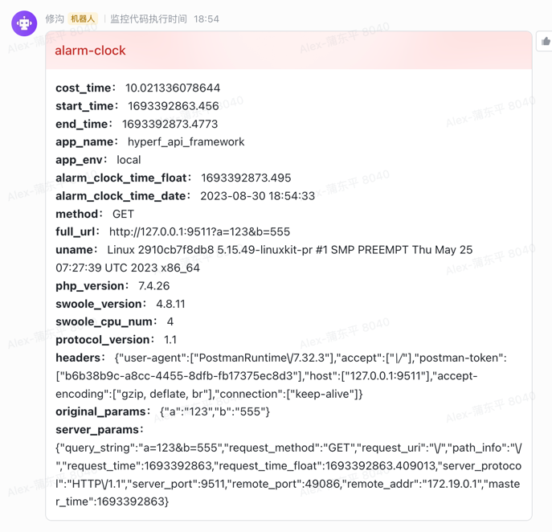

<h1 align="center">hyperf-alarm-clock</h1>

<p align="center">

[](https://packagist.org/packages/pudongping/hyperf-alarm-clock)
[](https://packagist.org/packages/pudongping/hyperf-alarm-clock)
[](https://packagist.org/packages/pudongping/hyperf-alarm-clock)
[](https://github.com/pudongping/hyperf-alarm-clock)
[](https://packagist.org/packages/pudongping/hyperf-alarm-clock)

</p>

计算代码执行时间，超时后并发送通知的小工具。

## 运行环境

- php >= 7.2
- composer
- hyperf ~2.2.0

## 安装

```shell
composer require pudongping/hyperf-alarm-clock:^1.0 -vvv
```

## 分支或者标签

### 分支

- **2.2:** For hyperf 2.2
- **3.0:** For hyperf 3.0

### 标签

- **1.0.x:** For hyperf 2.2
- **2.0.x:** For hyperf 3.0

## 配置

### 发布配置文件

在你自己的项目根目录下，执行以下命令，即可看到生成了 `config/autoload/hyperf_alarm_clock.php` 配置文件。

```shell
php bin/hyperf.php vendor:publish pudongping/hyperf-alarm-clock
```

### 修改配置

请直接修改 `config/autoload/hyperf_alarm_clock.php` 配置文件成你自己所需要的配置即可。

## 使用

请直接将 `\Pudongping\HyperfAlarmClock\AlarmClockMiddleware` 中间件添加到 `config/autoload/middlewares.php` 配置文件中即可。[关于中间件的配置，请参考官方文档](https://hyperf.wiki/3.0/#/zh-cn/middleware/middleware)

## 输出内容示例

- 使用标准输出作为通知通道



- 使用日志文件作为通知通道



- 使用飞书作为通知通道



## License

MIT, see [LICENSE file](LICENSE).
